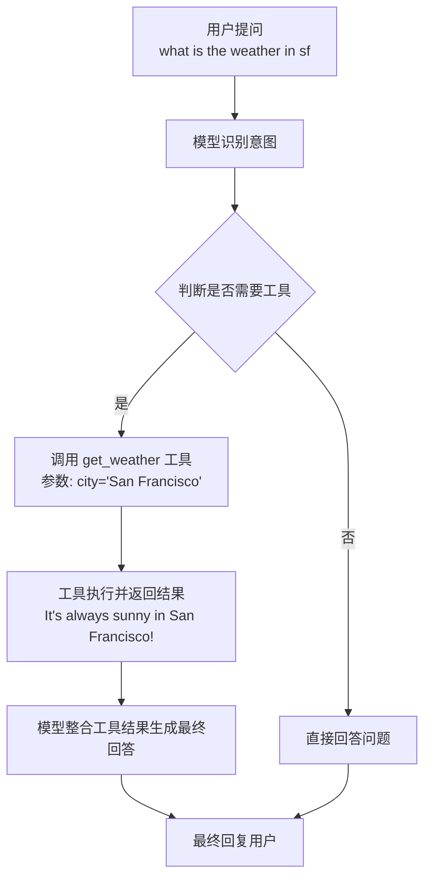

你的智能体（agent）成功调用了 `get_weather` 函数。从你提供的输出结果中，可以清晰地看到完整的工具调用和执行过程。

为了让你更直观地理解整个过程，我将其整理成了以下流程图，它展示了从用户提问到获得最终回答的完整链条：

下面是流程中几个关键步骤的详细证据，都体现在你提供的输出结果里：

1.  **工具调用请求**：模型首先识别出需要查询天气，并决定调用 `get_weather` 工具。在输出中，这体现在 `AIMessage` 的 `additional_kwargs` 字段里包含了 `tool_calls` 信息，其中明确指出了要调用的函数名和参数：`"function": {"arguments": "{"city":"San Francisco"}", "name": "get_weather"}`。

2.  **工具执行与结果**：随后，`get_weather` 函数被真正执行了。输出中的 `ToolMessage` 显示了执行结果：`content="It's always sunny in San Francisco!"`。这表明函数被正确调用，并返回了预设的字符串。

3.  **最终回答生成**：模型收到了工具返回的结果后，将其整合成一句友好的自然语言回复，即最后一个 `AIMessage` 的 `content`：`"The weather in San Francisco is currently sunny!"`。

所以，你的智能体工作得非常完美，完整地经历了“决策->调用工具->整合结果->回复用户”的流程。